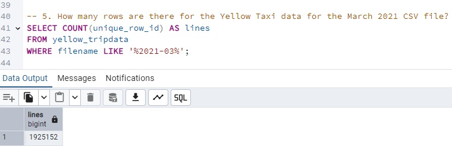

## Week 2 homework QUIZ answers  

#### 1 - Within the execution for Yellow Taxi data for the year 2020 and month 12: what is the uncompressed file size (i.e. the output file yellow_tripdata_2020-12.csv of the extract task)?
  
_The answer is:_ **134.5 MB**

#### 2 - What is the rendered value of the variable file when the inputs taxi is set to green, year is set to 2020, and month is set to 04 during execution?
_As the structure of the rendered value is:_ file: "{{inputs.taxi}}_tripdata_{{inputs.year}}-{{inputs.month}}.csv"  
_The answer is:_ **green_tripdata_2020-04.csv**

#### 3 - How many rows are there for the Yellow Taxi data for all CSV files in the year 2020?
  
_The answer is:_ **24,648,499**

#### 4 - How many rows are there for the Green Taxi data for all CSV files in the year 2020?
  
_The answer is:_ **1,734,051** 

#### 5 - How many rows are there for the Yellow Taxi data for the March 2021 CSV file?
  
_The answer is:_ **1,925,152**

#### 6 - How would you configure the timezone to New York in a Schedule trigger?
  
_The answer is:_ **Add a timezone property set to America/New_York in the Schedule trigger configuration**